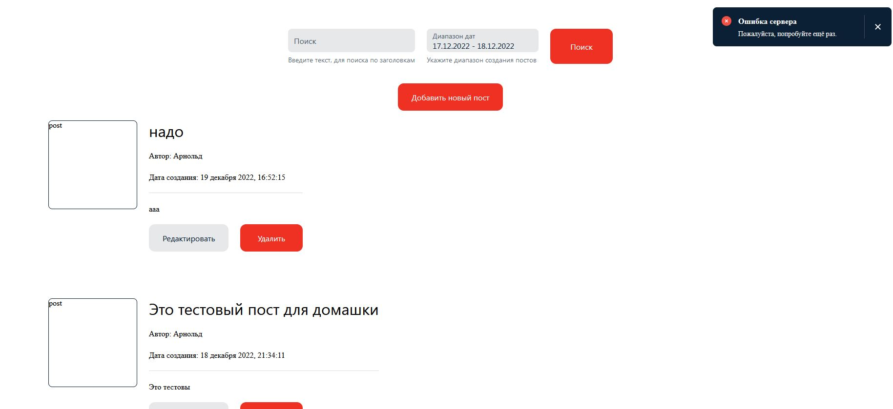

|===
|id |2.3

|Краткое описание
|Отсутствует подсказка у поля "Текст поста" в окне Новый пост при Добавлении нового поста (front)

|Приоритет
|Низкая срочность

|Серьезность
|Незначительный

|Дата обнаружения / Кто обнаружил
|22.12.2022  / Valentin K.

|Компонент
|Создание поста

|Шаги по воспроизведению
|1 Открыть страницу http://qa-games.ru/ раздел авторизация 2 В поле Email ввести "user3@example.com" 3 В поле Пароль ввести "Superbowl-recipe"  4 Нажать кнопку "Войти"  5 Нажать кнопку "Добавить новый пост"

|Ожидаемый результат
|Под полем "Текст поста" отображается подсказка (По примеру поля Название поста)

|Фактический результат
|Под полем "Текст поста" отсутствует подсказка

|Статус дефекта
|Новый

|Номер сборки
|1.2.0

|Окружение
|Windows version 11, Firefox 108.0.1 (64-разрядный)

|Скриншот / лог
|https://drive.google.com/file/d/1T8GNIRd2d3fKKI--Rlw38eGkK8XdajmY/view?usp=share_link
ссылка отказывается работать, файл приложу отдельно 2.3 Отсутствует подсказка у поля Текст поста в окне Новый пост при Добавлении нового поста.JPG

|Комментарий
|1 Должно быть единообразие. 2 Так же бы уточнил Подсказку по добавлению изображения, тк предполагаю что это тоже подсказка и должна соответствовать стилю.
|===
