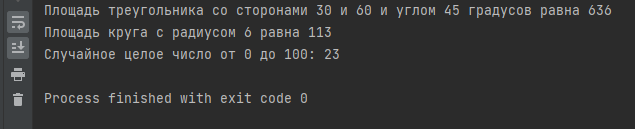
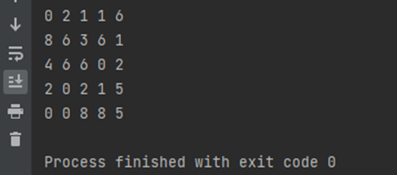

## Упражнение 1
Используя класс Math из библиотеки Java Core и документацию к нему, вычислить и вывести в консоль:

- площадь треугольника по формуле (0.5 * сторона а * сторона b * синус угла между сторонами), так же вывести исходные данные, результат округлить до целых

- площадь круга по формуле (PI * радиус в квадрете), так же вывести исходные данные, результат округлить до целых

- случайное ЦЕЛОЕ число от 0 до 100

Формат вывода в консоль:

Примечание:
- для выисления синуса угла нужно передать в метод угол в радианах,
для этого используйте метод toRadians из класса Math.
- исходные данные берите любые, а не те что на скрине
- число PI взять как константу из класса Math
- методы класса Math обязательные для использования: рассчет синуса, перевод в радианы, возведение в степень, округление, случайное число, остальные на ваще усмотрение

## Упражнение 2
Заполнить двумерный массив размером 5 на 5 случайными целыми числами от 0 до 9 и вывести в консоль в следующем виде:

Подсказка!
Эта команда выводит текст в консоль и переходит на новую строку

System.out.println();

Эта команда выводит текст в консоль и НЕ переходит на новую строку

System.out.print();