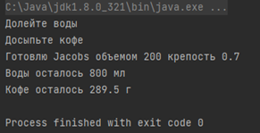

# Упражнение единственное
Написать программу для кофемашины согласно следующим требованиям. Тип и имена переменных выбрать самостоятельно, если они явно не указаны в задании. Требование к переменным – тип брать оптимальный, названия читабельными. Все поля классов сделать с модификатором private, все методы с модификатором public. Локальные переменные в методах использовать по своему усмотрению.

## Класс кофе
Представляет собой кофе, который мы засыпаем в кофемашину 
### Поля
- Название кофе

### Конструктор

- Принимает параметры название в виде строки и записывает его в соответствующее поле

### Метод

- Возвращает значение поля название кофе

## Класс кофемашина
Представляет собой сам аппарат в который мы засыпаем кофе, наливаем воду и запускаем алгоритм приготовления напитка

### Поля
- Текущее количество воды в машине (измеряется в миллилитрах)
- Максимально допустимое количество воды в машине - константа
- Текущее количество кофе в машине (измеряется в граммах)
- Максимально допустимое количество кофе в машине - константа
- Норма потребления кофе при приготовлении напитка с максимально крепостью (крепость напитка измеряется от 0 до 1, где 1 самый крепкий) - константа
- Кофе – агрегирует класс кофе

### Методы
- Получение текущего остатка кофе в кофемашине в виде строки типа «Кофе осталось 289.5 г».
- Получение текущего остатка кофе в кофемашине в виде строки типа «Воды осталось 800 мл».
- Наполнение воды в кофемашину, метод принимает параметр какое количество воды нужно добавить к текущему остатку воды и отслеживает чтобы текущий остаток не превышал максимально допустимое количество воды.
- Наполнение кофе в кофемашину, метод принимает параметр какое количество кофе нужно добавить к текущему остатку кофе и отслеживает чтобы текущий остаток не превышал максимально допустимое количество кофе. Вторым параметром метод принимает класс кофе, то есть какой именно кофе вы засыпаете в кофемашину.
- Приготовить напиток, метод принимает параметры крепость напитка (от 0 до 1) и объем чашки и реализует следуюий алгоритм:
  - Проверяет если объем чашки больше текущего объема воды, то возвращает строку «Долейте воды»
  - Проверяет хватит ли кофе на приготовление напитка (по формуле Норма потребления умножить на крепость) если кофе не хватает, то возвращает строку «Досыпьте кофе»
  - Если всего хватает, то вычитает объем чашки от текущего объема воды в кофемашине и необходимый для приготовления объем кофе от текущего объема кофе в кофемашине и выводит сообщение типа «Готовлю Jacobs объемом 200 крепость 0.7»

## Стартовый класс программы
Содержит метод main откуда запускается программа. Метод main содержит следующий алгоритм:
- Создать объект кофе, передав в конструктор название и тип
- Создать объект кофемашины
- Вызвать метод приготовления напитка
- Вывести ошибку в консоль
- Заполнить кофемашину водой через соответствующий метод
- Вызвать метод приготовления напитка
- Вывести ошибку в консоль
- Засыпать в кофемашину кофе через соответствующий метод
- Вызвать метод приготовления напитка
- Вывести в консоль отчет кофемашины о приготовлении кофе
- Вывести в консоль текущий остаток воды в кофемашине
- Вывести в консоль текущий остаток кофе в кофемашине

Вот такой вывод в консоль получился у меня:

